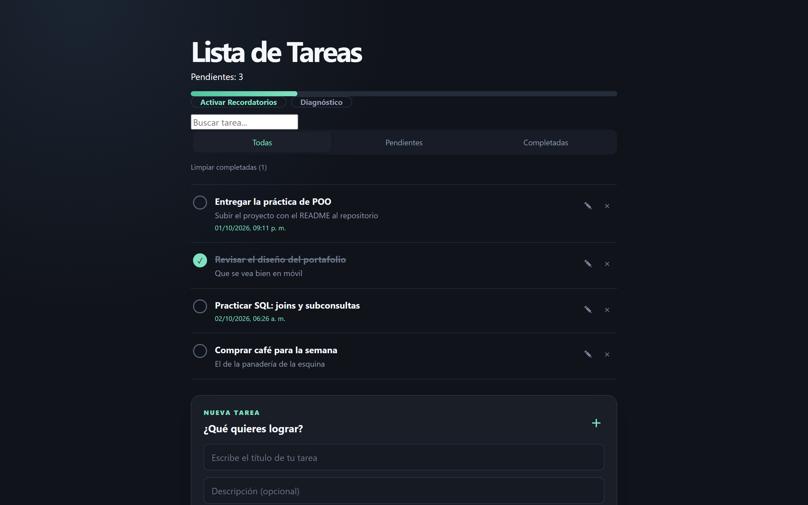
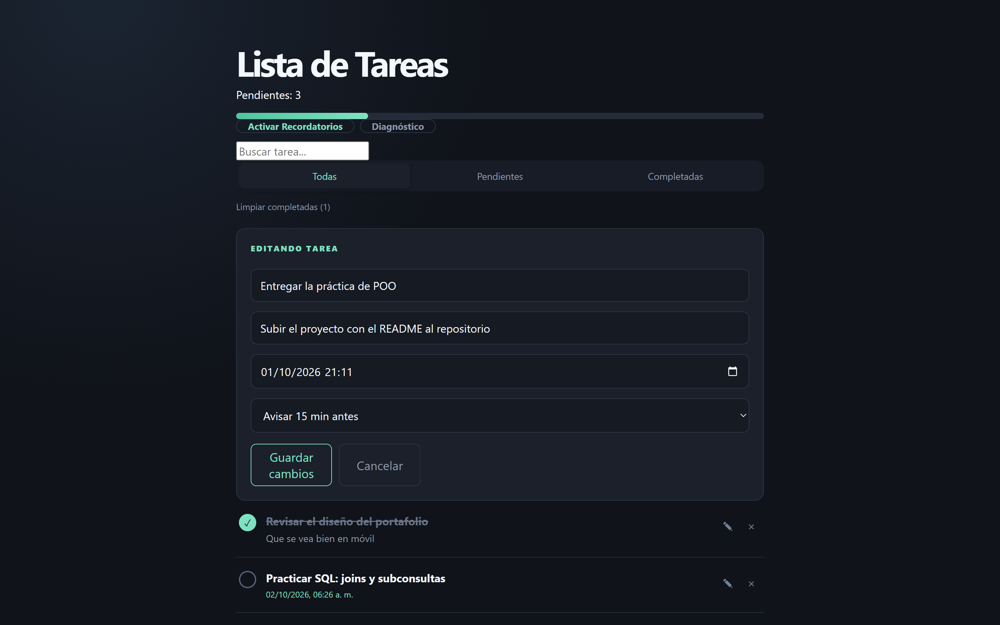
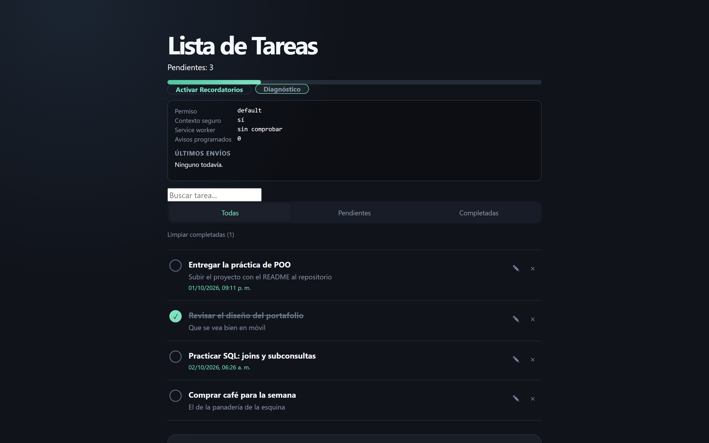
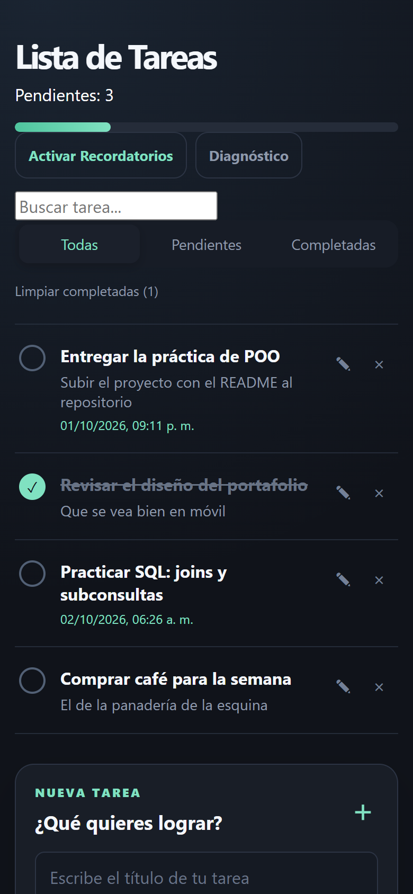

# Lista de Tareas · React PWA

Gestor de tareas que funciona como aplicación de escritorio, con recordatorios
del navegador que avisan antes de que algo venza. React 19, Vite y
`localStorage`; sin backend.



##  Tecnologías


##  Características

Lo de siempre está: alta, edición en línea, marcar como completada, eliminar,
filtros, búsqueda por título y descripción, barra de progreso y un botón para
tirar las completadas. Todo se guarda en `localStorage`, así que cerrar la
pestaña no pierde nada.

Lo que no es tan obvio:

- **Recordatorios por tarea.** Cada tarea puede llevar fecha límite y elegir
  cuánto antes avisar: 15 minutos, 30 minutos, una hora o un día. Si la fecha
  ya pasó, avisa que está vencida en vez de quedarse esperando.
- **Instalable.** `vite-plugin-pwa` con Workbox y `autoUpdate`, manifiesto
  propio e iconos 192/512, así que se añade a la pantalla de inicio y abre sin
  barra de navegador.
- **Panel de diagnóstico.** Permiso actual, si el contexto es seguro, si hay
  service worker registrado, cuántos avisos hay agendados y el resultado de los
  últimos envíos. Los problemas de notificaciones casi nunca se pueden depurar
  a ciegas, así que la app los expone.
- **El botón no promete lo que no puede hacer.** Si abriste la app por la IP de
  red o el permiso quedó bloqueado, el botón lo dice y al pulsarlo explica
  cómo arreglarlo, en vez de fallar en silencio.

##  Instalación y uso

```bash
git clone https://github.com/Lu-Capu/04-To-Do_List.git
cd 04-To-Do_List
npm install
npm run dev
```

Abre `http://localhost:5173`.

>  Las notificaciones del navegador **solo funcionan en contexto seguro**:
> `https://` o `http://localhost`. Si abres la app por la IP de red
> (`http://192.168.x.x:5173`), el botón dirá "Abrir en localhost".

### Scripts

| Comando | Descripción |
|---|---|
| `npm run dev` | Servidor de desarrollo con HMR |
| `npm run build` | Compila a `dist/` |
| `npm run preview` | Sirve `dist/` para probar el build |
| `npm run lint` | ESLint sobre todo el proyecto |

##  Estructura

```
src/
├── main.jsx                  # Punto de entrada
├── App.jsx                   # Estado global, búsqueda, filtros y progreso
├── App.css
├── index.css
├── components/
│   ├── TaskForm.jsx          # Alta de tareas (título, fecha, anticipación)
│   ├── TaskList.jsx          # Render de la lista
│   ├── TaskItem.jsx          # Vista + modo edición de cada tarea
│   └── TaskFilter.jsx        # Filtros y "limpiar completadas"
└── hooks/
    └── useNotificaciones.js  # Lógica de permisos, agenda y envío
public/                      # logo-negro.png e iconos del manifiesto
```

##  Notas técnicas

Casi todo el peso está en `useNotificaciones.js`. Los avisos no se programan
con un `setTimeout` y ya, porque `setTimeout` tiene dos límites que rompen este
caso: no puede esperar más de 2³¹−1 ms (unos 24.8 días) y se congela cuando la
pestaña pasa a segundo plano o el equipo suspende. Así que cada alarma se
parte en trozos del máximo permitido y, al dispararse, se reprograma por lo que
falte (`useNotificaciones.js:53`). Encima de eso, un listener de
`visibilitychange` recalcula la agenda completa cuando la app vuelve a primer
plano, con lo que da igual cuántas veces haya dormido el sistema.

Lo segundo que se repite es el aviso duplicado al recargar. La clave que se
guarda en `localStorage` es el par *id de tarea* + *timestamp objetivo*: si ya se
mandó para ese par, no se vuelve a mandar aunque la tarea siga pendiente. El
registro se recorta a los últimos 200 para que no crezca para siempre.

El envío va por dos rutas. Primero `registration.showNotification()`, que es la
única que sobrevive con la app en segundo plano. Si no hay service worker
registrado o esa llamada falla, cae a `new Notification()`. El error concreto
de cada intento queda registrado y se ve en el panel de diagnóstico, en vez de
un `catch` mudo.

Un detalle que costó: `permission === "denied"` no vuelve a preguntar al
navegador, nunca. La única salida es que el usuario toque el candado junto a la
barra de direcciones y lo cambie a mano, así que el botón tiene que llevar a
esa instrucción específica en vez de reintentar y rendirse.

El resto de la app es estado en `useState` y un `useEffect` que escribe
`localStorage` cuando cambia `tareas`. Búsqueda y filtro se calculan sobre ese
mismo array en cada render, así que no hay estado duplicado que pueda
desincronizarse.

## 📸 Capturas

**Vista principal** — lista, barra de progreso y recordatorios


**Editando una tarea**



**Panel de diagnóstico** — permiso, contexto seguro, service worker, avisos agendados y últimos envíos



**Vista móvil**



## 🔗 Demo en vivo

[💻 Ver código](https://github.com/Lu-Capu/04-To-Do_List)

> Demo desplegada en GitHub Pages pendiente de publicar.

## 📄 Licencia

[MIT](LICENSE)
